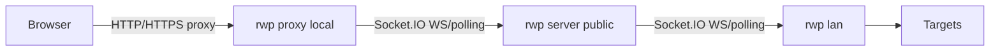

# remote-ws-proxy (rwp)

Remote HTTP/HTTPS proxy transported over Socket.IO (WebSocket with HTTP long-poll fallback). The CLI exposes three roles:

- `rwp server` — relay hub that routes messages between a LAN agent and one or more proxies.
- `rwp lan <server-url> [session]` — agent that runs inside the private network and executes HTTP/TCP requests.
- `rwp proxy <server-url> [session] [port]` — local HTTP proxy; configure your browser to point to it.



## Quick start

Requirements: Node.js 18+.

Install deps:

```bash
npm install
```

Start the relay server (default port 8080, plain WS). Behind HTTPS, put it behind a reverse proxy that upgrades to WebSocket:

```bash
npm run start
# or: rwp server --port 9000 --host 0.0.0.0
```

On the remote/LAN side, register the session:

```bash
rwp lan https://your-rwp-endpoint.example.com/my-session
# still valid: rwp lan my-session ws://server-host:8080
# to reach the server via an outbound proxy: rwp lan https://your-rwp-endpoint.example.com/my-session --proxy http://proxy:3128
# if the outbound proxy uses an untrusted TLS cert (not recommended): add --insecure
```

Locally, run the HTTP proxy (default port 3128):

```bash
rwp proxy https://your-rwp-endpoint.example.com/my-session 3128
# or keep the old form: rwp proxy my-session ws://server-host:8080 3128
# outbound proxy support: rwp proxy https://your-rwp-endpoint.example.com/my-session 3128 --proxy http://proxy:3128
```

Configure your browser/system proxy to `http://127.0.0.1:3128`. HTTP and HTTPS (via CONNECT) are supported.

### Transport modes
- `--transport auto` (default): tries WebSocket first, falls back to HTTP long-poll if WS is blocked (e.g., corporate proxy returning 403 on Upgrade).
- `--transport ws`: WebSocket only.
- `--transport http`: HTTP long-poll only (no Upgrade).
Example with HTTP transport and outbound proxy:  
`rwp lan https://your-rwp-endpoint.example.com/my-session --transport http --proxy http://proxy:3128`  
`rwp proxy https://your-rwp-endpoint.example.com/my-session 3128 --transport http --proxy http://proxy:3128`

## Docker
- Image: `<dockerhub_user>/remote-ws-proxy:<tag>` (see `DOCKER.md` for full env reference).
- Roles via env: `ROLE` = server|lan|proxy; `SERVER_URL` can embed the session path, or use `SERVER` + `SESSION`.

### Run via npx directly from GitHub (no local clone)

```bash
npx -y -p github:nicolas-albert/remote-ws-proxy rwp --help
npx -y -p github:nicolas-albert/remote-ws-proxy rwp proxy https://your-rwp-endpoint.example.com/my-session 3128
```

### Offline/air-gapped install from a release archive

1. Download the `.tar.gz` (Linux/macOS) or `.zip` (Windows) asset attached to a tagged release (`v*`) on GitHub.
2. Extract:
   - macOS/Linux: `tar -xzf remote-ws-proxy-<tag>.tar.gz && cd remote-ws-proxy-<tag>`
   - Windows: unzip the `.zip` archive.
3. Node.js 18+ required. No npm install needed (dependencies bundled).
4. Run directly: `node bin/rwp.js server ...`, `node bin/rwp.js lan ...`, `node bin/rwp.js proxy ...`.

## Behavior notes

- Messages are JSON framed over WebSocket with base64 payloads for bodies and tunnel data.
- A single LAN connection is accepted per session; a new LAN connection replaces the previous one.
- If the LAN disconnects, pending proxy requests are failed with a 502.
- HTTP requests are forwarded with hop-by-hop headers stripped; HTTPS uses CONNECT tunnels with raw TCP piping.
- You can pass `http://` or `https://` URLs; they are automatically converted to `ws://` or `wss://` for the WebSocket handshake. The session can be provided as a trailing path segment in the URL.
- Both `rwp lan` and `rwp proxy` accept `--proxy` (or environment `HTTP_PROXY` / `HTTPS_PROXY`) to reach the WebSocket server through an upstream proxy.

## CLI help

```bash
rwp --help
rwp server --help
rwp lan --help
rwp proxy --help
```
